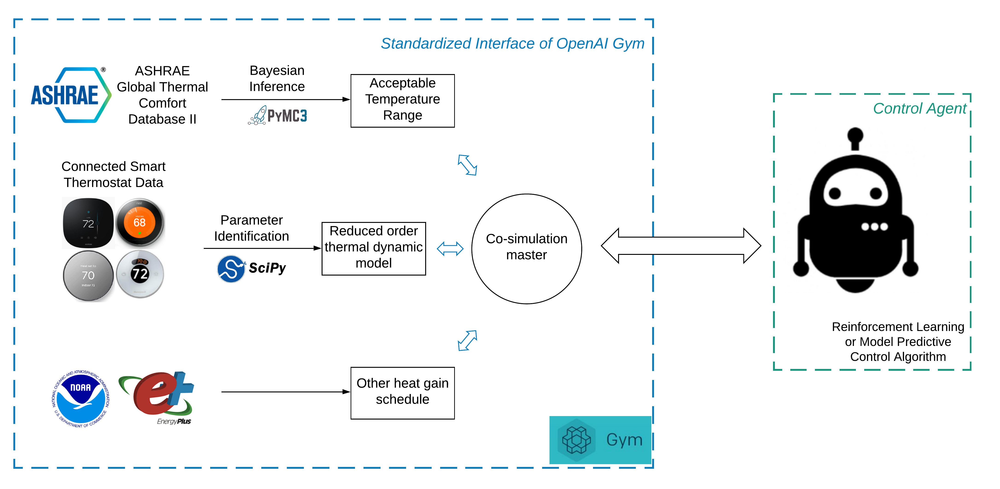

# AlphaBuilding ResCommunity

This is the official repository of AlphaBuilding ResCommunity, a multi-agent OpenAI Gym Environment for Thermally Controlled Loads (TCLs) Coordination. An introduction to this environment can be found in the following paper:

> *Zhe Wang, Bingqing Chen, Han Li, Tianzhen Hong. 2021. AlphaBuilding ResCommunity: A Multi-agent ReninforcementLearning Environment for Load Coordination. Submitted to Applied Energy*

<!--
[[slides]](docs/slides.pdf)[[paper]](https://dl.acm.org/doi/10.1145/3408308.3427980)
-->

# Overview
Wind and Solar combined accounts for 9% of total Unite States electricity generation in 2019, and is expected to make up of at least 40% of the generation mix by 2050. Higher renewable penetration requires more efficient demand side management to maintain real time balance of the grid. 

We developed AlphaBuilding ResCommunity, a multi-agent OpenAI Gym Environment that can be used to train TCLs Coordination algorithms to shift the load and provide grid services. In this repository: a. we develope and open source a realistic virtual environment using large scale connected smart thermostat data; b. We demonstrate how this environment could be used to develop, test and compare control algorithms for load coordination of residential buildings.

Compared with existing efforts, *AlphaBuilding ResCommunity* has the following two advantages:
- More realistic, because: a. the mdoel parameter values are inferred from a database recording the building operational data of more than 80,000 households in the Unite States; b. we consider occupancy schedule and other heat gains that have been ignored in existing studies.
- Simple software dependence and easy to use. *AlphaBuilding ResCommunity* is wrapped up using the standardize OpenAI Gym enivorenment, that is widely used in the Reinforcement Learning community. 




# Code Usage
### Clone repository
```
git clone https://github.com/LBNL-ETA/AlphaBuilding-ResCommunity.git
cd AlphaBuilding-ResCommunity
```

### Set up the environment 
Set up the virtual environment with your preferred environment/package manager.

The instruction here is based on **conda**. ([Install conda](https://docs.anaconda.com/anaconda/install/))
```
conda create --name alpBuiResCom python=3.8 -c conda-forge -f requirements.txt
conda activate alpBuiResCom
```

### Repository structure
``bin``: Runnable programs, including Python scripts and Jupyter Notebooks

``data``: Raw data, including the distribution of inferred parameters of TCLs for each state, comfortable range, occupancy schedule

``docs``: Manuscript submitted version

``results``: Cleaned-up data, generated figures and tables


### Running
<!--
You can replicate our experiments, generate figures and tables used in the manuscript using the Jupyter notebooks saved in ``bin``: `section3.1 EDA.ipynb`, `section3.2 linear model.ipynb`, `section3.3 time-series model.ipynb`, `section3.4 tabular data model.ipynb`, `section4.1 model comparison.ipynb`, `section4.2 heat wave.ipynb`, `section4.3 convid.ipynb`
-->

### Feedback

Feel free to send any questions/feedback to: [Zhe Wang](mailto:zwang5@lbl.gov ) or [Tianzhen Hong](mailto:thong@lbl.gov)

### Citation

If you use our code, please cite us as follows:

<!--
```
@inproceedings{Chen2020COHORT,
author = {Chen, Bingqing and Francis, Jonathan and Pritoni, Marco and Kar, Soummya and Berg\'{e}s, Mario},
title = {COHORT: Coordination of Heterogeneous Thermostatically Controlled Loads for Demand Flexibility},
year = {2020},
isbn = {9781450380614},
publisher = {Association for Computing Machinery},
address = {New York, NY, USA},
url = {https://doi.org/10.1145/3408308.3427980},
doi = {10.1145/3408308.3427980},
booktitle = {Proceedings of the 7th ACM International Conference on Systems for Energy-Efficient Buildings, Cities, and Transportation},
pages = {31–40},
numpages = {10},
keywords = {demand response, smart thermostats, TCLs, distributed control},
location = {Virtual Event, Japan},
series = {BuildSys '20}
}
```
-->
