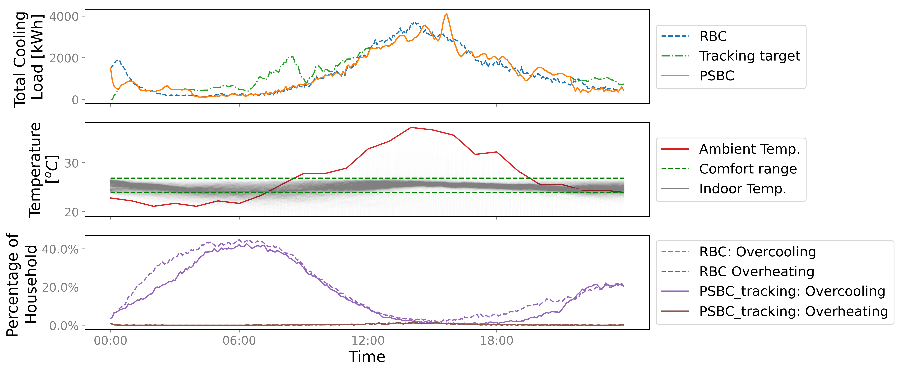
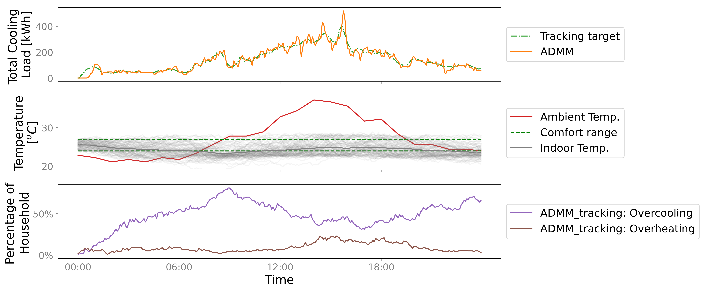

# AlphaBuilding ResCommunity

This is the official repository of AlphaBuilding ResCommunity, a multi-agent OpenAI Gym Environment for Thermally Controlled Loads (TCLs) Coordination. An introduction to this environment can be found in the following paper:

> *Wang, Z., Chen, B., Li, H. and Hong, T., 2021. AlphaBuilding ResCommunity: A multi-agent virtual testbed for community-level load coordination. Advances in Applied Energy, 4, p.100061.*

[[paper]](https://doi.org/10.1016/j.adapen.2021.100061)

# Overview
Wind and Solar combined accounts for 9% of total Unite States electricity generation in 2019, and is expected to make up of at least 40% of the generation mix by 2050. Higher renewable penetration requires more efficient demand side management to maintain real time balance of the grid.

We developed AlphaBuilding ResCommunity, a multi-agent OpenAI Gym Environment that can be used to train TCLs Coordination algorithms to shift the load and provide grid services. In this repository: a. we develope and open source a realistic virtual environment using large scale connected smart thermostat data; b. We demonstrate how this environment could be used to develop, test and compare control algorithms for load coordination of residential buildings.

Compared with existing efforts, *AlphaBuilding ResCommunity* has the following two advantages:
- More realistic, because: a. the mdoel parameter values are inferred from a database recording the building operational data of more than 80,000 households in the Unite States; b. we consider occupancy schedule and other heat gains that have been ignored in existing studies.
- Simple software dependence and easy to use. *AlphaBuilding ResCommunity* is wrapped up using the standardize OpenAI Gym enivorenment, that is widely used in the Reinforcement Learning community.


# Code Usage
### Clone repository
```
git clone https://github.com/LBNL-ETA/AlphaBuilding-ResCommunity.git
cd AlphaBuilding-ResCommunity
```

### Set up the environment
Set up the virtual environment with your preferred environment/package manager.

The instruction here is based on **conda**. ([Install conda](https://docs.anaconda.com/anaconda/install/))
```
conda create --name alpBuiResCom python=3.8 -c conda-forge -f requirements.txt
conda activate alpBuiResCom
```

### Repository structure
``bin``: Runnable programs, including Python scripts and Jupyter Notebooks

``bin\util``: Utility functions and data, including the distribution of inferred parameters of TCLs for each state, comfortable range, occupancy schedule, and ADMM algorithm

``data``: Raw data used in this repo, including 

``docs``: Manuscript submitted version, and documentation of this environment

``gym_AlphaBuilding``: Code to develop the OpenAI Gym environment of AlphaBuilding

``results``: Generated figures and tables

### Running
<!--
You can replicate our experiments, generate figures and tables used in the manuscript using the Jupyter notebooks saved in ``bin``: `section3.1 EDA.ipynb`, `section3.2 linear model.ipynb`, `section3.3 time-series model.ipynb`, `section3.4 tabular data model.ipynb`, `section4.1 model comparison.ipynb`, `section4.2 heat wave.ipynb`, `section4.3 convid.ipynb`
-->

# Interface
The co-simulation workflow between the environment and the controller is:


The first step is to initiate the environment. A list of input parameters to set up the environment is shown as follows:

| Input Parameter      | Description                                                            | Data Type| Default Value |
|----------------------|------------------------------------------------------------------------|----------|---------------|
| sampleSize           | Number of residential buildings to be simulated                        | int      |               |
| stepSize             | Step size of simulation, unit: [min]                                   | int      |               |
| simHorizon           | Start and final date of simulation                                     | tuple    |               |
| ambientWeather       | Ambient weather data of ambient temperature and cloud cover (optional) | dataframe|               |
| ttc                  | Thermal Time Constant, mean and std                                    | tuple    |               |
| teq                  | Equivalent temperature increase due to other heat gains, mean and std  | tuple    |               |
| hvacMode             | Heating or cooling or both                                             | string   |               |
| tsp                  | Indoor temperature set point, mean and std                             | tuple    |               |
| trange               | Acceptable temperature range, mean and std                             | tuple    |               |
| costWeight           | Weight between comfort and energy to calculate reward                  | tuple    | (10, 1)       |
| rcRatio              | R to C ratio, mean and std                                             | tuple    | (0.7, 0.4)    |
| copH                 | Heating COP, mean and std                                              | tuple    | (2.5,0.5)     | 
| copC                 | Cooling COP, mean and std                                              | tuple    | (2.5,0.5)     |
| teqHQ                | Equivalent temperature of heating, mean and std                        | tuple    | (50,10)       |
| teqCQ                | Equivalent temperature of cooling, mean and std                        | tuple    | (-50,10)      |
| x0                   | Initial temperature, mean and std                                      | tuple    |Uniform between lower and upper comfort bound|
| otherHGMethod        | Method to calculate other heat gains                                   | string   | 'Eocbee'      |
| internalHeatGainRatio| Percentage of internal heat gain of total other heat gain, mean and std| tuple    | (0.3, 0.1)    |
| noiseSigma           | standard deviation of model noise                                      | float    | 0.03          |
| measurementErrorSigma| standard deviation of measurement error, unit [degC]                   | float    | 0.5           |

Then at each time step, the environment consumes ``acts`` (determined by the controller), runs a single time step simulation, and returns ``obs`` and ``comments``. The contents of ``acts``, ``obs``, and ``comments`` are shown as follows:


A list of methods provided by the environment is as follows:

| Methods                  | Example                          | Input          | Returns                                       |
|--------------------------|----------------------------------|----------------|-----------------------------------------------|
| Initiate the env         | ``env=AlphaResEnv(*args)``       | Env parameters | An environment instance                       |
| Reset the env            | ``obs=env.reset()``              | \              | Observations (Initial conditions)             |
| One step simulation      | ``obs,r,d,c=env.step(acts)``     | Control actions| New observations, reward, done flag, comments |
| Get env parameters       | ``pars = env.getParameters()``   | \              | Environment parameters                        |
| Weather forecast         | ``wFore = env.weatherForecast()``| \              | Hourly weather forecast of the next 24 hours  |
| Other Heat Gain forecast | ``hgFore = env.otherHGForecast()``| \              | Hourly prediction of other heat gains (solar + internal) of the next 24 hours |


# Application
``AlphaBuilding ResCommunity`` can be used to train TCL controllers. As an example, we demonstrate four applications here:

### Kalman Filter
Kalman Filter is a technique to integrate the physical model and inaccurate measurements for more accurate state estimation. We implement a Kalman Filter using Python Library ``pykalman`` in ``bin\Section4.1 Kalman_filter.ipynb`` and here is the result:


### MPC for single TCL
Though ``AlphaBuilding ResCommunity`` is designed majorly for TCLs coordination, it can also be used to train controller for single TCL using either Model Predictive Control or Reinforcement Learning. We implement an MPC controller using Python Library ``casadi`` to reduce costs based on Time-Of-Use utility price in ``bin\Section4.2 Single TCL MPC.ipynb`` and here is the result:


### PSBC for 1000 TCLs
Priority-Stack-Based Control (PSBC) is a feedback based controller that can be used to track target load. We implement a PSBC controller in ``bin\Section4.3&4.4 PSBC&ADMM.ipynb`` and here is the result:



### ADMM for 100 TCLs
Alternating Direction Method of Multipliers (ADMM) is an algorithm that solves convex optimization problems by breaking them into smaller pieces. We implement an ADMM controller using Python Library ``cvxpy`` in ``bin\Section4.3&4.4 PSBC&ADMM.ipynb`` and here is the result:



# Feedback

Feel free to send any questions/feedback to: [Zhe Wang](mailto:zwang5@lbl.gov ) or [Tianzhen Hong](mailto:thong@lbl.gov)

# Citation

If you use our code, please cite us as follows:

<!--
```
@inproceedings{Chen2020COHORT,
author = {Chen, Bingqing and Francis, Jonathan and Pritoni, Marco and Kar, Soummya and Berg\'{e}s, Mario},
title = {COHORT: Coordination of Heterogeneous Thermostatically Controlled Loads for Demand Flexibility},
year = {2020},
isbn = {9781450380614},
publisher = {Association for Computing Machinery},
address = {New York, NY, USA},
url = {https://doi.org/10.1145/3408308.3427980},
doi = {10.1145/3408308.3427980},
booktitle = {Proceedings of the 7th ACM International Conference on Systems for Energy-Efficient Buildings, Cities, and Transportation},
pages = {31–40},
numpages = {10},
keywords = {demand response, smart thermostats, TCLs, distributed control},
location = {Virtual Event, Japan},
series = {BuildSys '20}
}
```
-->
